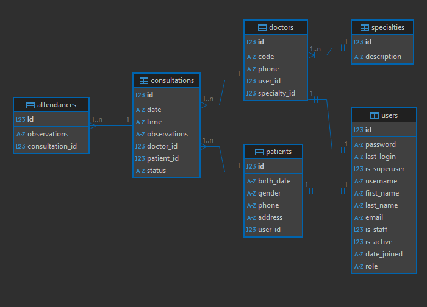

- instalar o python
- instalar git
- python -m venv venv
- venv\Scripts\activate
- python -m pip install django
- python -m pip install django-ninja
- python -m pip install django-ninja-extra
- python -m pip install django-ninja-jwt
- django-admin startproject core .
- python manage.py startapp users
- python manage.py startapp consultations
- git init

# Diagrama Relacional
